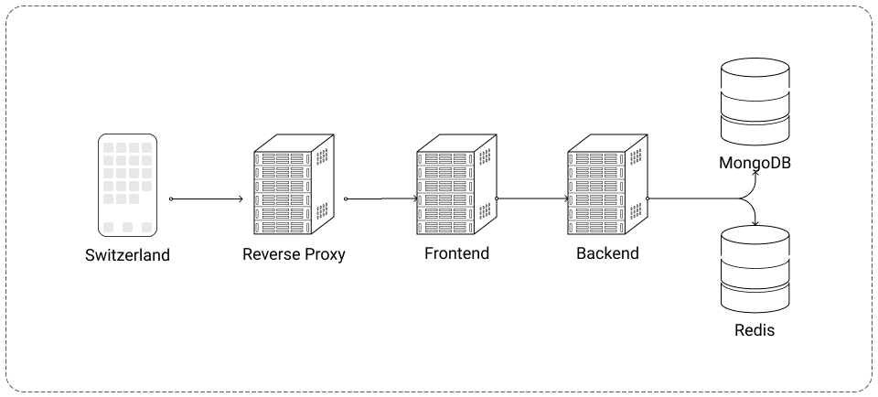
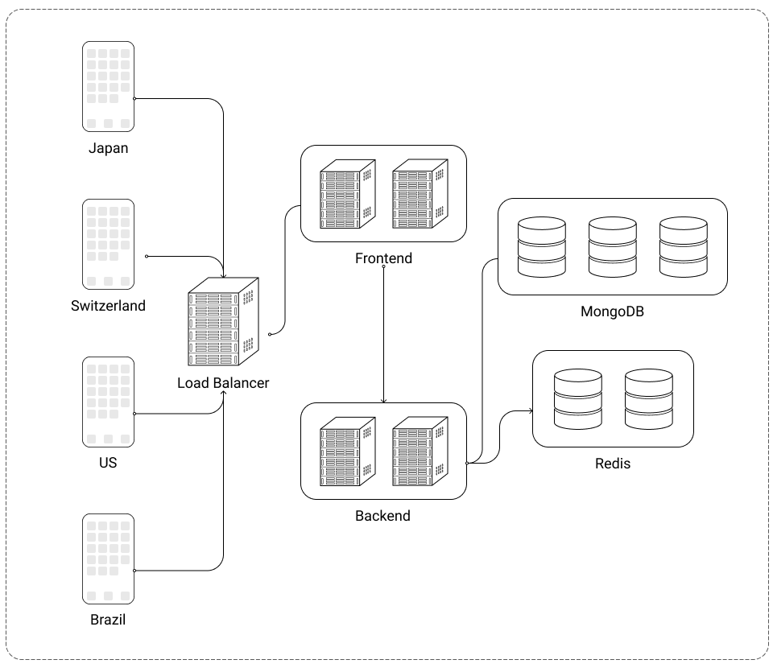
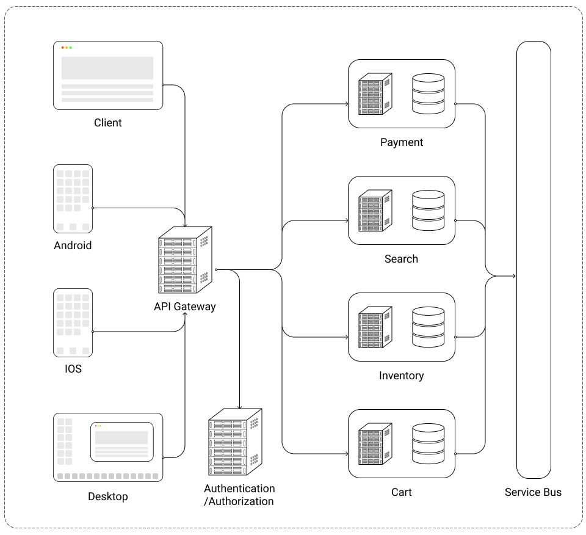

# Backend

## Model, View, Controller

The most basic architecture for the application, would be a monolithic MVC architecture.

In the front of the application would sit a reverse proxy, like Nginx, Apache or Envoy, it redirects HTTP and HTTPS trafic to the frontend or the backend.

As for the databases, there would be a MongoDB database and Redis in-memory database. MongoDB is the principle database and Redis is used for rate-limiting and for storing TTL informations.

<figure>
  
  <figcaption>Personal Diagram</figcaption>
</figure>

## Scaling Architecture

This second architecture is almost as the first one, exept that it was design with redundancy in mind. The MongoDB databases would form a cluster, with quorum master worker election.

In this design, instead of using a reverse proxy, the trafic woul be handled via a load balancer, it would balance the incoming trafic to the services.

The best way of distributing trafic would be with the Round Robin algorithm. Least Connect, Weight and Ip Hash Algorithm are also possible but very specific.

<figure>
  
  <figcaption>Personal Diagram</figcaption>
</figure>

## Microservices

The microservices architecture is mostly used by large teams in big companies, it prones service ownership, fast delivery and large scale.

The advantage of microservices is that each service does just on thing very well.

Each service has it's own database and databases communicates via the [Saga Pattern](https://www.youtube.com/watch?v=xDuwrtwYHu8&ab_channel=GOTOConferences) between them.

Service communication is handled via a service bus, like Apache Kafka or RabbitMQ.

Authentication and authorization would be handled via an access management service like [Keycloak](https://www.keycloak.org/).

The API Gateway, the only service which calls the microservices, would allow to decrease backend complexity to the frontend.

<figure>
  
  <figcaption>Personal Diagram</figcaption>
</figure>

### CI/CD

| CI/CD   |                URI                | Description |
| :------ | :-------------------------------: | :---------- |
| Ansible | [Link](https://docs.ansible.com/) |             |
| Jenkins |  [Link](https://www.jenkins.io/)  |             |

### Provisioning

| Provisioner |                URI                | Description |
| :---------- | :-------------------------------: | :---------- |
| Terraform   | [Link](https://www.terraform.io/) |             |

### Monitoring

| Monitoring |                  URI                  | Description |
| :--------- | :-----------------------------------: | :---------- |
| Grafana    |     [Link](https://grafana.com/)      |             |
| Prometheus |    [Link](https://prometheus.io/)     |             |
| Jaeger     | [Link](https://www.jaegertracing.io/) |             |

### Service Bus

| Service Bus |                URI                | Description |
| :---------- | :-------------------------------: | :---------- |
| Kafka       | [Link](https://kafka.apache.org/) |             |
| RabbitMQ    | [Link](https://www.rabbitmq.com/) |             |

### API

| API     |                                  URI                                  | Description |
| :------ | :-------------------------------------------------------------------: | :---------- |
| REST    | [Link](https://en.wikipedia.org/wiki/Representational_state_transfer) |             |
| GraphQL |                     [Link](https://graphql.org/)                      |             |
| gRPC    |                       [Link](https://grpc.io/)                        |             |

### Containers

| Container  |               URI               | Description |
| :--------- | :-----------------------------: | :---------- |
| Docker     | [Link](https://www.docker.com/) |             |
| Kubernetes | [Link](https://kubernetes.io/)  |             |
| Istio      |    [Link](https://istio.io/)    |             |

### Databases

| Database      |                    URI                     | Description |
| :------------ | :----------------------------------------: | :---------- |
| MySQL         |       [Link](https://www.mysql.com/)       |             |
| PostgreSQL    |    [Link](https://www.postgresql.org/)     |             |
| MongoDB       |     [Link](https://www.mongodb.com/2)      |             |
| Redis         |         [Link](https://redis.io/)          |             |
| Neo4j         |         [Link](https://neo4j.com/)         |             |
| Elasticsearch |      [Link](https://www.elastic.co/)       |             |
| Solr          | [Link](https://solr.apache.org/index.html) |             |

### Access Management

| Service  |                URI                | Description |
| :------- | :-------------------------------: | :---------- |
| Keycloak | [Link](https://www.keycloak.org/) |             |

### Chaos Engineering

| Tool          |                URI                | Description |
| :------------ | :-------------------------------: | :---------- |
| Chaos Toolkit | [Link](https://chaostoolkit.org/) |             |

