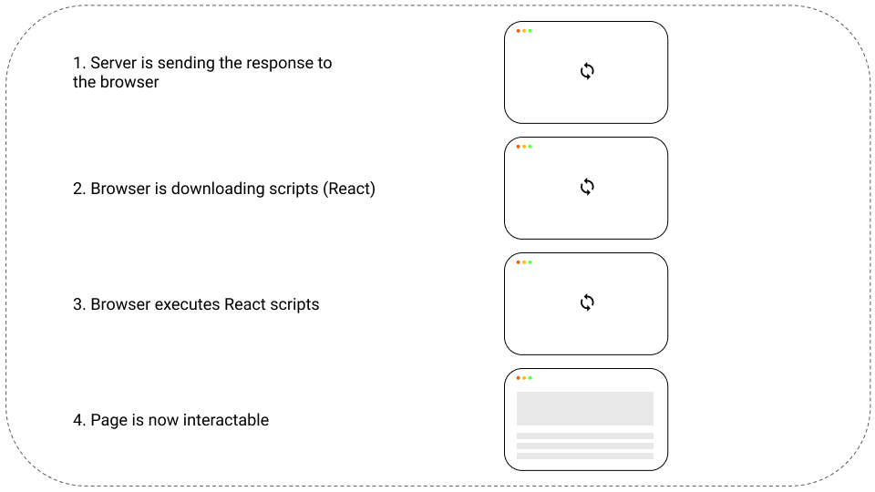
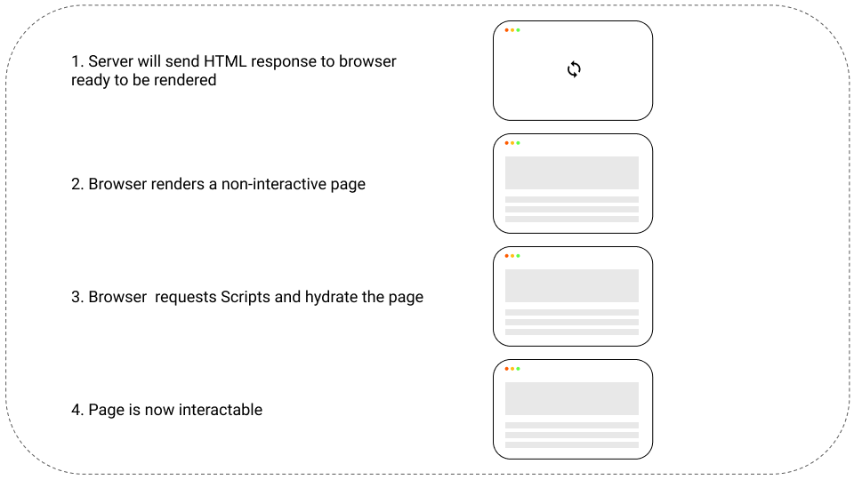
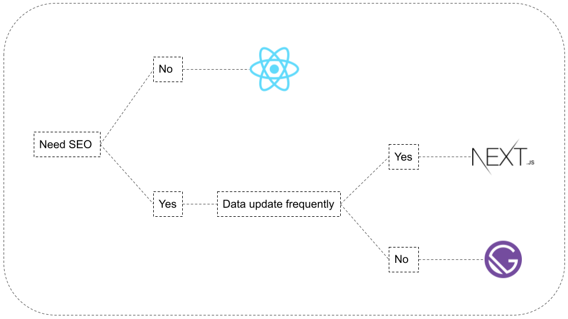

# Next

### Client Side Rendering

Client side rendering is faster at rendering after initial load, it comes with greate user experience, good variety of libraries and frameworks.

Client side rendering doesn't shine with initial load time and SEO. For the moment, search engines like Bing, Yandex and more struggle to index web pages with a lot of Javascript, their ranking performs badly.

<figure>
  
  <figcaption>Personal Diagram</figcaption>
</figure>

### Server Side Rendering

In contrast to client side rendering, Javascript is rendered as HTML, making it possible to be indexed in the first round trip by search engines and improve SEO.

Initial load times are improved, allowing users to get content much faster in opposite with client side rendering. Decreasing load time, improves SEO and converts more clients.

The process of server side rendering after initial load is higher than with client side rendering.

<figure>
  
  <figcaption>Personal Diagram</figcaption>
</figure>

### Choice

For this project, Next.js was choosed over Gatsby and create-react-app for it's server-side rendering capabilities and for it's SEO support.

<figure>
  
  <figcaption>Personal Diagram</figcaption>
</figure>

