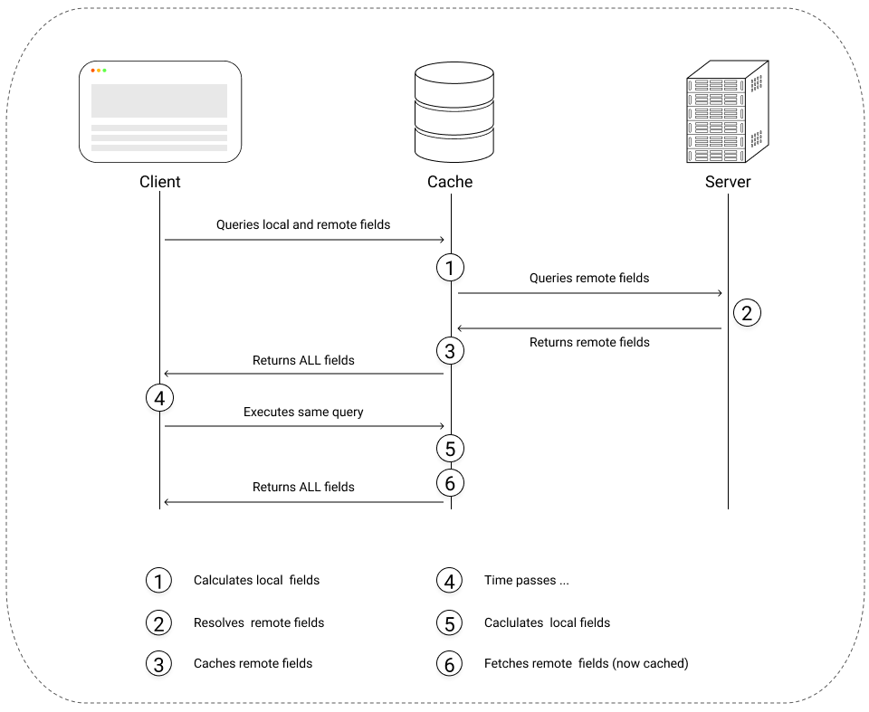

# State Management

## Apollo Client

<figure>
  
  <a href="https://www.apollographql.com/docs/react/local-state/local-state-management/">
  <figcaption>Image: Inspired From Apollo Docs</figcaption>
  </a>
</figure>

|                        | Basic Usage(recommended)            | Advanced                  |
| :--------------------- | :---------------------------------- | :------------------------ |
| Initializing state     | Cache Policies                      | N/A                       |
| Local state management | Reactive variables + Cache Policies | N/A                       |
| State update           | cache.readQuery + cache.writeQuery  | cache.modify, cache.evict |
| Pagination             | cache.radQuery + cache.writeQuery   | Cache Policies            |

<figure>
  <a href="https://youtu.be/xASrlg9rmR4?t=1176">
  <figcaption>Apollo 3 Presentation, Khalil Stemmer</figcaption>
  </a>
</figure>

## Other State Management Solution

## Libraries

| Library                |                             URI                             | Description                                                                                                                                                                                               |
| :--------------------- | :---------------------------------------------------------: | :-------------------------------------------------------------------------------------------------------------------------------------------------------------------------------------------------------- |
| Apollo Client          |      [Link](https://www.apollographql.com/docs/react/)      | Apollo Client is a GraphQL client library, it's simple API allows to use it as a local state management tool and to quickly write business code which mathers, in comparison of Redux's long boilerplate. |
| GraphQL Code Generator |         [Link](https://graphql-code-generator.com/)         | GraphQL Code Generator allows to convert a GraphQL API into Typescript.                                                                                                                                   |
| Apollo-Upload-Client   | [Link](https://github.com/jaydenseric/apollo-upload-client) |                                                                                                                                                                                                           |

