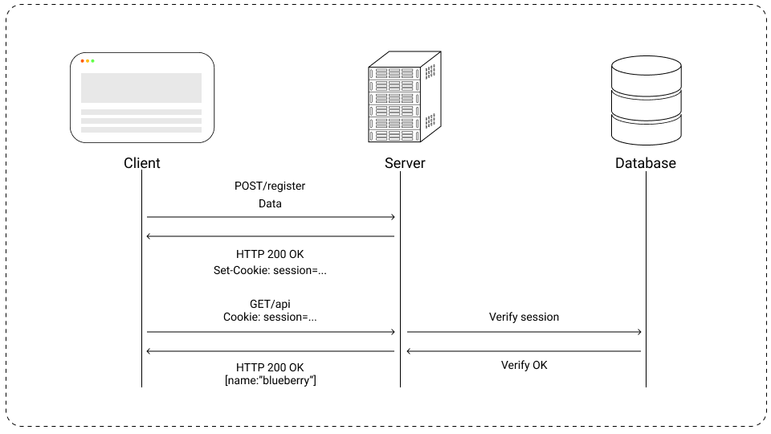
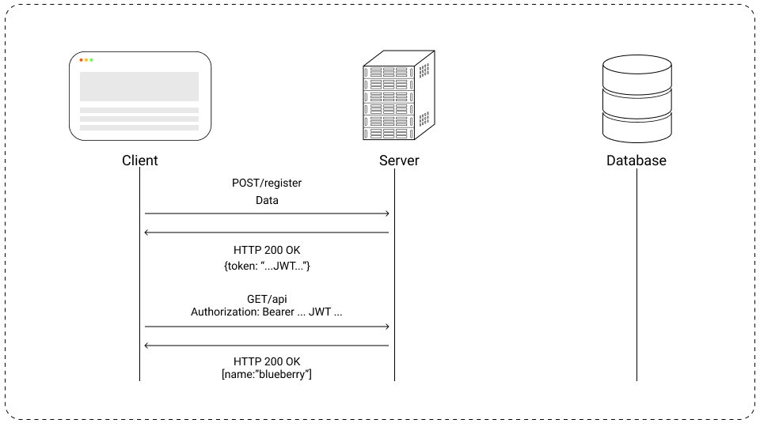

# Server

<hr/>

## Authentication

Authentication is a broad topic, it can be achived in many ways, like session and cookies, session and in-memory database like Redis, and so on.

At the end of the day, authentication is all about tradeofs, control or scalability.

### Session Authentication

Using sessions for authentication gives great control over the service that the application provides to the end user.

For obvious reasons, an administrator can create, ban, block or delete a user.



<hr/>

### JWT Authentication

Json Web Tokens are great for scalability, when using tokens, an extra round trip to the database is saved, improving performance and user experience.

The down side of JWT tokens is that when the server emits a token, it has no more control over it. So, if a user violates a rule of conduct, the administrator can't block that user immediatly.

A way to resolve this, is to add a Time To Live value to the token.



<hr/>

### Authentication choice

## Authorization

<hr/>

## OAuth2

<hr/>

## Payment

<hr/>

## AWS S3

<hr/>

## Testing

<hr/>

## Environment Variables

!!! warning inline end

    Environement Variables are sensible informations injected just before a server is starting.

    Don't forget to add the environment variable file to <b>.gitignore</b>, otherwise bots will scrape GitHub for sensible information and use your aws credentials, for example, for bitcoin mining.

```
PORT=
MONGO_ATLAS=

JWT_SECRET=
JWT_EXPIRES_IN=

SENDGRID_API=

REDIS_HOST=
REDIS_PORT=
REDIS_PASSWORD=
REDIS_URL=

GITHUB_CLIENT_ID=
GITHUB_CLIENT_SECRET=

GOOGLE_ID=
GOOGLE_SECRET=
```

<hr/>

## Libraries

| Library               |                                     URI                                      | Description                                                                                                                                                                                           |
| :-------------------- | :--------------------------------------------------------------------------: | :---------------------------------------------------------------------------------------------------------------------------------------------------------------------------------------------------- |
| Node.js               |                        [Link](https://nodejs.org/en/)                        | Node.js is a Javascript runtime environment, not a programming language. It'uses Chrome's open source Javascript engine, V8. By incorporating V8, it has access to the OS APIs.                       |
| Typescript            |                   [Link](https://www.typescriptlang.org/)                    | Typescript is a superset of Javascript, it allows to add types in development and detect compilation errors at compile time.                                                                          |
| Apollo-server-express | [Link](https://www.apollographql.com/docs/apollo-server/v1/servers/express/) | Apollo-server-express, not to confuse with apollo-server, integrates very well with an existing Express server and adds GraphQL capabilties.                                                          |
| TypeGraphQL           |                       [Link](https://typegraphql.com/)                       | TypeGraphQL allows to build a Typescript GraphQL API very easily, by just defining resolvers and using decorators, it automaticly creates a GraphQL schema DSL file.                                  |
| Typegoose             |                [Link](https://typegoose.github.io/typegoose/)                | Typegoose is a Typescript wrapper over mongoose for MongoDB. Instead of creating mongoose definitions and then create object interfaces for using Typescript, Typegoose handles this with decorators. |
| Passport              |                      [Link](http://www.passportjs.org/)                      | Passport is a authentication middleware for Node.js, it allows with the help of strategies to add OAuth capabilities to the application.                                                              |

<hr/>

## Sources

| Source                       |  Author  |                                                                          URI |
| :--------------------------- | :------: | ---------------------------------------------------------------------------: |
| GraphQL                      | Official |                                                 [Link](https://graphql.org/) |
| How to GraphQL               | Tutorial |                                        [Link](https://www.howtographql.com/) |
| TypeGraphQL Youtube Playlist | Ben Awad | [Link](https://michaelstromer.nyc/books/strongly-typed-next-js/introduction) |

<hr/>
