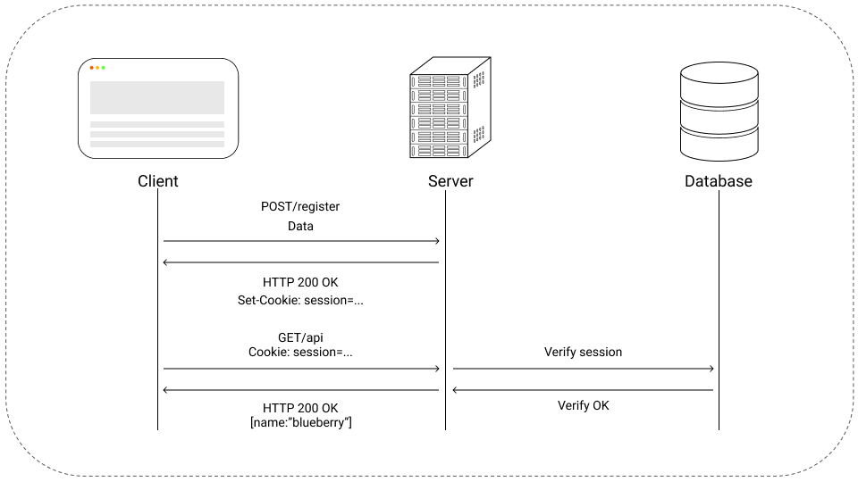
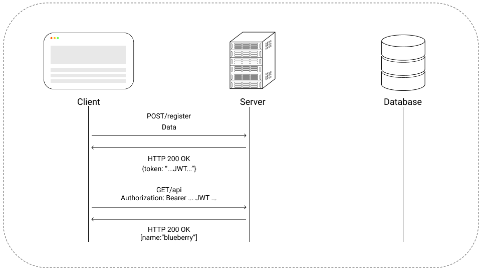

# Authentication

Authentication is a broad topic, it can be achived in many ways, like session and cookies, session and in-memory database like Redis, and so on.

At the end of the day, authentication is all about tradeofs, control or scalability.

## Session Authentication

Using sessions for authentication gives great control over the service that the application provides to the end user.

For obvious reasons, an administrator can create, ban, block or delete a user.

<figure>
  
  <figcaption>Personal Diagram</figcaption>
</figure>

## JWT Authentication

Json Web Tokens are great for scalability, when using tokens, an extra round trip to the database is saved, improving performance and user experience.

The down side of JWT tokens is that when the server emits a token, it has no more control over it. So, if a user violates a rule of conduct, the administrator can't block that user immediatly.

A way to resolve this, is to add a Time To Live value to the token.

<figure>
  
  <figcaption>Personal Diagram</figcaption>
</figure>

## Project Solution

Initially, the application was designed to only handle authentication with JWT tokens stored in localStorage. Not only localStorage is vulnerable to XSS attacks but also when Next.js does server side rendering, there is no localStorage API or other storage API available to the server, besides cookies.

The solution to this problem was to use both, localStorage API and cookies. Each time that a user calls a page, on server side first, the cookie is sent to the GraphQL authentication middleware. After the page has loaded, transiting from page to page is done via the localstorage API.

For the moment this is an hybrid solution, not the most elegant solution, but it works, until a refactor which will fixed the poor design issues of the frontend.

## Libraries

| Library  |                URI                 | Description                                                                                                                              |
| :------- | :--------------------------------: | :--------------------------------------------------------------------------------------------------------------------------------------- |
| Passport | [Link](http://www.passportjs.org/) | Passport is a authentication middleware for Node.js, it allows with the help of strategies to add OAuth capabilities to the application. |
