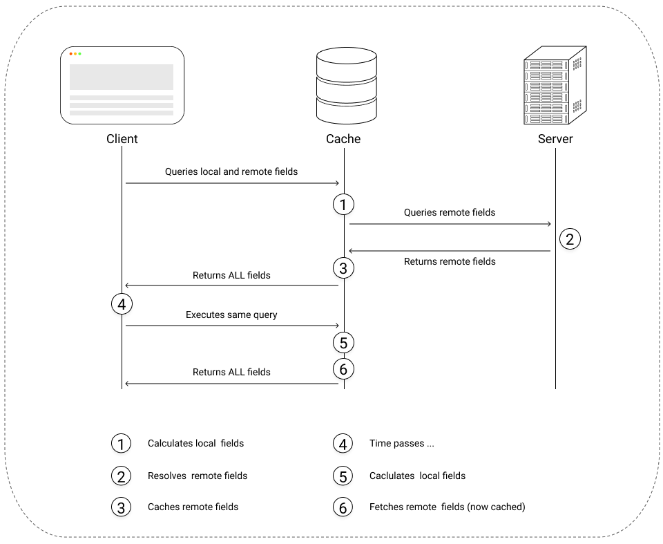

# State Management

## Apollo Client

Instead of writing imperative javascript, specially for events, state management allows in a declarative way to respond to certain events. State management allows to manage the growing complexity of current modern web applications.

Apollo client is simply a client library for GraphQL backends, available for React, Vue and Angular, it comes with a cache and there are almost no boilerplate involving it.

<figure>
  
  <a href="https://www.apollographql.com/docs/react/local-state/local-state-management/">
  <figcaption>Image: Inspired From Apollo Docs</figcaption>
  </a>
</figure>

|                        | Basic Usage(recommended)            | Advanced                  |
| :--------------------- | :---------------------------------- | :------------------------ |
| Initializing state     | Cache Policies                      | N/A                       |
| Local state management | Reactive variables + Cache Policies | N/A                       |
| State update           | cache.readQuery + cache.writeQuery  | cache.modify, cache.evict |
| Pagination             | cache.radQuery + cache.writeQuery   | Cache Policies            |

<figure>
  <a href="https://youtu.be/xASrlg9rmR4?t=1176">
  <figcaption>Apollo 3 Presentation, Khalil Stemmer</figcaption>
  </a>
</figure>

## Other State Management Solution

The application could have used a different state management library, like Redux. Actually it did at the beginning, but the code for just writing some actions and some reducers introduced huge boilerplate to maintain, it represents in most cases for ~40-60% of an app frontend's code.

Due to the large boilerplate code,[Apollo Client](https://www.apollographql.com/docs/react/) was choosed over [Redux](https://redux.js.org/)

## Libraries

| Library                |                        URI                        | Description                                                                                                                                                                                               |
| :--------------------- | :-----------------------------------------------: | :-------------------------------------------------------------------------------------------------------------------------------------------------------------------------------------------------------- |
| Apollo Client          | [Link](https://www.apollographql.com/docs/react/) | Apollo Client is a GraphQL client library, it's simple API allows to use it as a local state management tool and to quickly write business code which mathers, in comparison of Redux's long boilerplate. |
| GraphQL Code Generator |    [Link](https://graphql-code-generator.com/)    | GraphQL Code Generator allows to convert a GraphQL API into Typescript.                                                                                                                                   |

