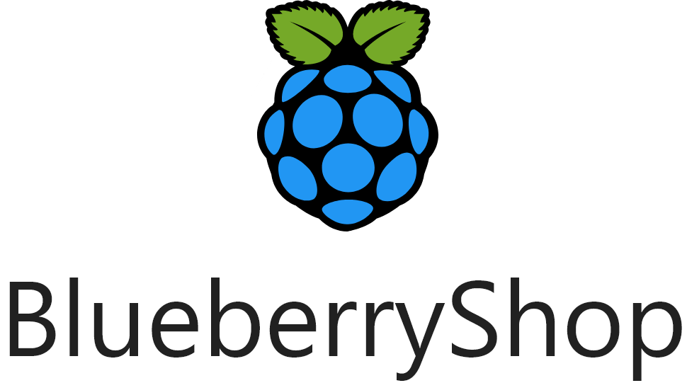

    

 

# Documentation

[Google Doc](https://docs.google.com/document/d/1AMvA4kfWDmtYyRRf82kJECiWAPGyYOuv52SHW4-XSzg/edit?usp=sharing)

# Technical Documentation

[Github Pages](https://bessejrani.github.io/BlueberryShop/)

# Work Journal

[Google Sheets](https://docs.google.com/spreadsheets/d/1g0Z7ZT4ccx9flkn4aJOiYmJgGDuXXLZPLvZdZ__xoMw/edit?usp=sharing)

# Design

[Figma](https://www.figma.com/file/KyebwZhNLSHQOyJKPqfKCw/BlueberryShop-UI-UX?node-id=0%3A1)

# Planification

[Google Sheets](https://docs.google.com/spreadsheets/d/1jIQItHRQQbo5qSRwQaEWgpYrC_pfSHzqOyH-FqbtHnw/edit?usp=sharing)